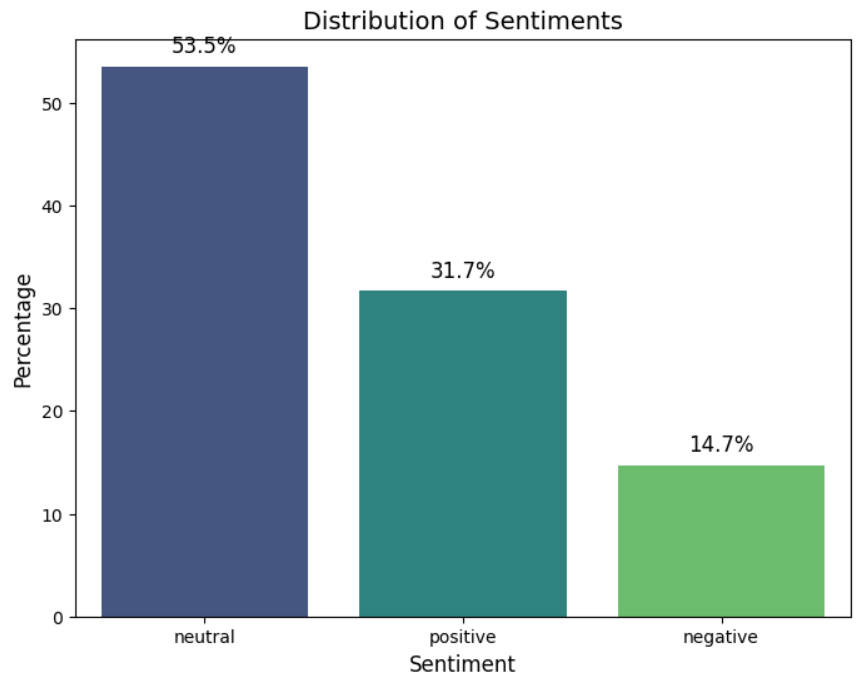
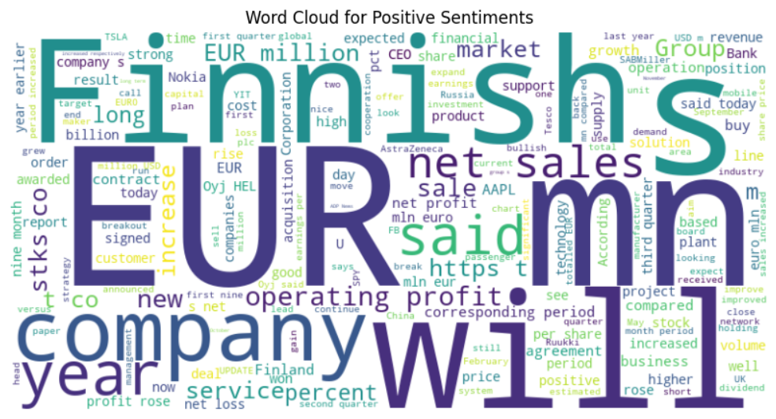
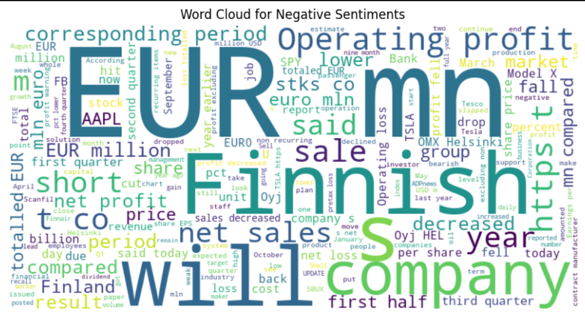
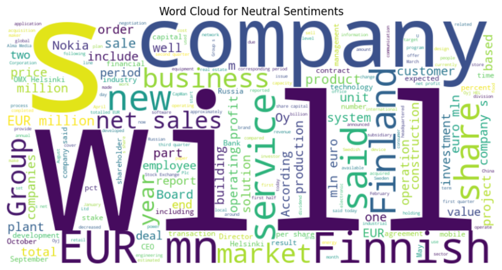

# RoBERTa Sentiment Analysis

A Natural Language Processing (NLP) project that uses the RoBERTa Transformer model to classify text into Positive, Negative, and Neutral sentiment categories.

## Overview

This project implements a complete sentiment analysis pipeline using RoBERTa (`roberta-base`) and PyTorch.

The workflow includes:

- Data cleaning and preprocessing
- Sentiment distribution analysis
- Word cloud visualization
- Dataset balancing
- RoBERTa tokenization
- Model training
- Model evaluation
- Sentiment prediction with confidence score

## Features

- 3-class sentiment classification
- Positive, Negative, and Neutral sentiment detection
- Balanced dataset
- NLTK-based text preprocessing
- RoBERTa Transformer model
- PyTorch training pipeline
- Accuracy and classification report
- Confidence score for predictions
- Sentiment visualization

## Tech Stack

- Python
- PyTorch
- Hugging Face Transformers
- RoBERTa
- NLTK
- Pandas
- NumPy
- Scikit-learn
- Matplotlib
- Seaborn
- WordCloud
- Jupyter Notebook

## Sentiment Classes

| Label | Sentiment |
|---|---|
| 0 | Negative |
| 1 | Neutral |
| 2 | Positive |

## Project Workflow

Raw Dataset → Data Cleaning → Text Preprocessing → Sentiment Analysis → Dataset Balancing → RoBERTa Tokenization → Model Training → Model Evaluation → Sentiment Prediction

## NLP Preprocessing

The text data is processed using:

- Lowercase conversion
- URL removal
- Special character and number removal
- Whitespace cleaning
- Tokenization
- Stopword removal
- Lemmatization

## Dataset Balancing

The dataset was balanced so that each sentiment class contains equal samples.

- Negative: 1666 samples
- Neutral: 1666 samples
- Positive: 1666 samples
- Total: 4998 samples

## Model

The project uses the RoBERTa Base (`roberta-base`) Transformer model.

The model is fine-tuned for a 3-class sentiment classification task.

## Training Configuration

| Parameter | Value |
|---|---|
| Model | roberta-base |
| Number of Classes | 3 |
| Epochs | 3 |
| Batch Size | 16 |
| Learning Rate | 2e-5 |
| Maximum Sequence Length | 128 |
| Optimizer | AdamW |
| Framework | PyTorch |

## Model Evaluation

The trained model is evaluated using:

- Accuracy
- Precision
- Recall
- F1-Score
- Classification Report

The notebook also includes sentiment prediction with confidence scores.

## Prediction

The model can predict the sentiment of new text and provide a confidence score.

Example:

Input: I really enjoyed this product.

Prediction: Positive

## Screenshots

### Sentiment Distribution

### Positive Word Cloud

### Negative Word Cloud

### Neutral Word Cloud

## Project Structure

- `sentiment_analysis_using_roberta.ipynb`
- `data.csv`
- `README.md`
- `screenshots/`
  - `sentiment-distribution.png`
  - `positive-wordcloud.png`
  - `negative-wordcloud.png`
  - `neutral-wordcloud.png`

## Installation

Clone the repository:

`git clone https://github.com/Rohan30020407/RoBERTa-Sentiment-Analysis.git`

Install required libraries:

`pip install pandas numpy matplotlib seaborn scikit-learn nltk wordcloud torch transformers`

## Running the Project

Open the Jupyter Notebook:

`sentiment_analysis_using_roberta.ipynb`

Run the notebook cells sequentially to perform preprocessing, visualization, training, evaluation, and sentiment prediction.

## Future Improvements

- Train for more epochs
- Experiment with other Transformer models
- Hyperparameter tuning
- Deploy the model as a web application
- Create a REST API
- Add real-time sentiment analysis

## Author

Rohan Soni

GitHub: https://github.com/Rohan30020407